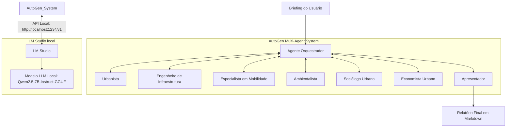

# Arquitetura do Sistema - CityVision AI

Esta seção descreve a integração física e lógica dos componentes do sistema.

## 🖥️ Papel do LM Studio
O **LM Studio** atua como o servidor local de inferência de LLMs. Ele disponibiliza uma API local compatível com o protocolo da OpenAI. Isso garante que todo o processamento de linguagem ocorra na máquina local, preservando a privacidade dos dados do projeto e eliminando custos com APIs de nuvem.

## 🤖 Papel do AutoGen
O **AutoGen** gerencia a conversa entre os agentes. Ele define as regras de turnos de fala, injeta as diretrizes de sistema (System Messages) de cada agente e permite a transição ordenada das mensagens para que o debate tenha início, meio e fim.

## 🧠 Papel dos Modelos LLM
Os modelos carregados (como **Qwen2.5-7B-Instruct-GGUF**, Llama 3, ou Mistral) realizam o processamento cognitivo. A qualidade, criatividade e coesão lógica do plano dependem diretamente da capacidade do modelo selecionado em assumir a persona descrita em sua configuração de forma eficiente sem estourar o limite de VRAM física do hardware.
